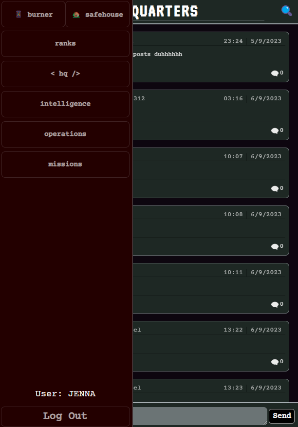
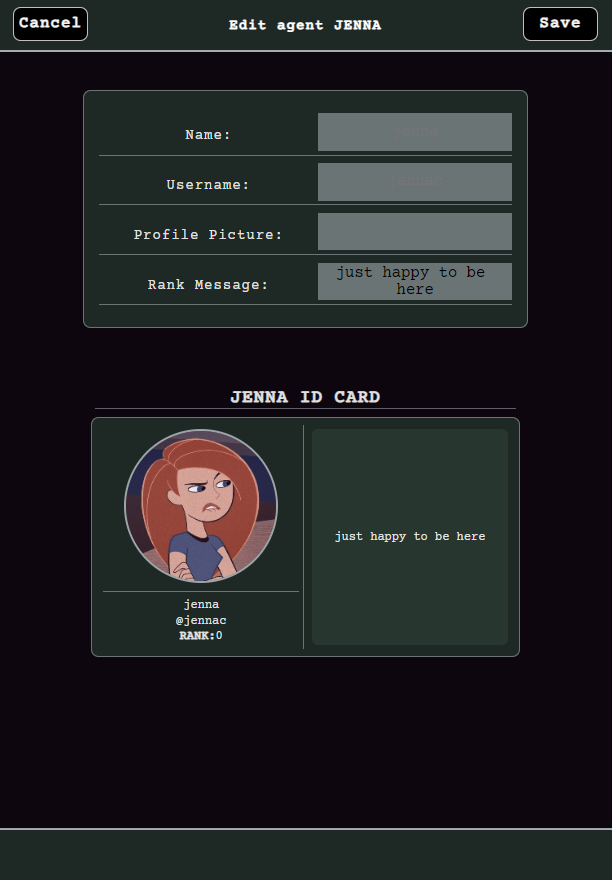
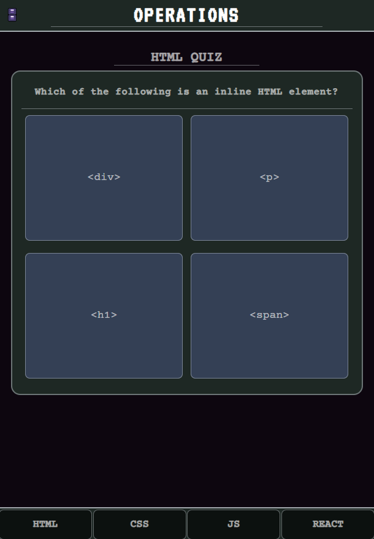
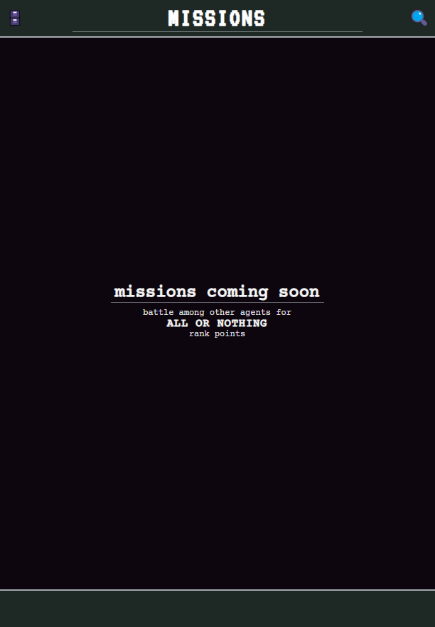

# < HQ />
## MERN PROJECT
###### Deployed App: [HeadQuarters](https://hq-q9zl.onrender.com)

    Headquarters is a social media app that allows users (read - "agents") to connect and converse. Users can have conversations in multiple locations. HQ offers a private dm for users to write notes to self. HQ also features a quiz game to test the user's tech knowledge.

##### ERD (Entity Relationship Diagram): [Draw.io](https://app.diagrams.net/#LHQ)

#### Images

    
    
    

##### Technologies Used
<ul>
    <li>MongoDB</li>
    <li>Express</li>
    <li>React.js</li>
    <li>Node.js</li>
    <li>CSS</li>
</ul>

##### Unsolved Problems
<ul>
    <li>Deployment</li>
    <li>CSS conflicts</li>
</ul>

##### Future Enhancements
<ul>
    <li>Burner Page (read - "direct messages")</li>
    <li>Missions - for users to battle one another in MERN related questions</li>
</ul>
    